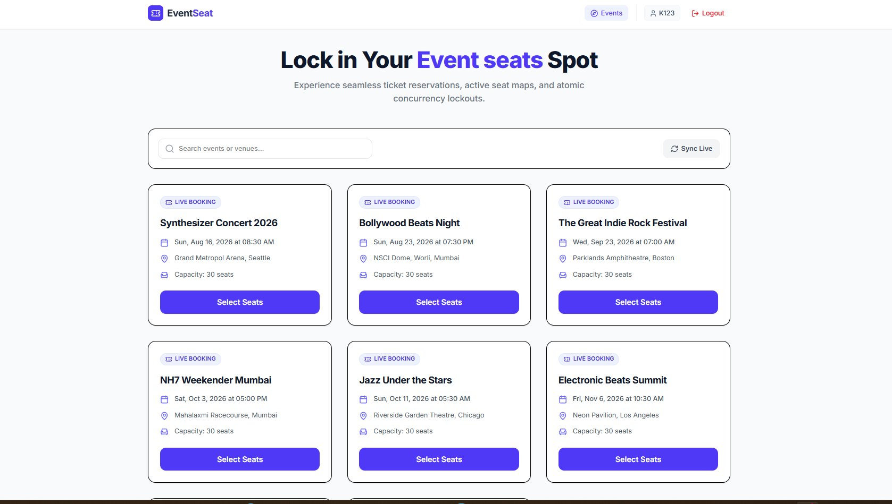
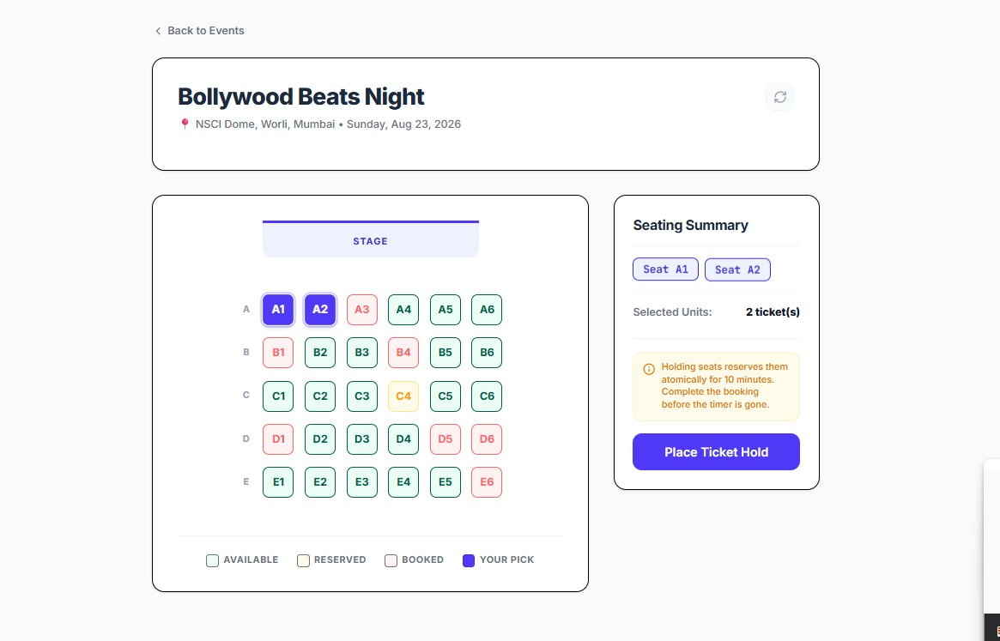
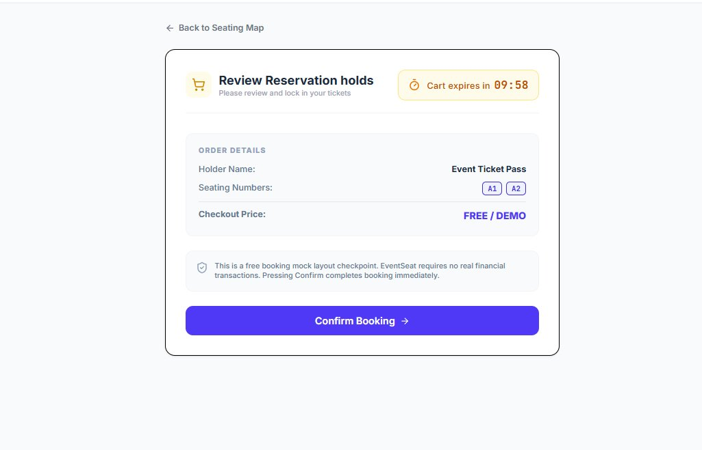
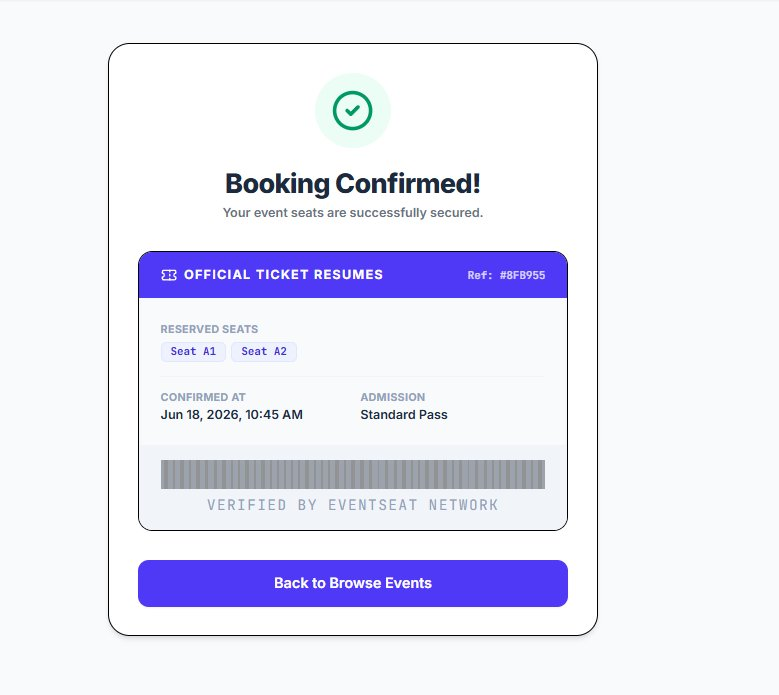

# 🎟️ EventSeat — Event Ticket Booking System

> A full-stack MERN application for seamless event seat reservation with atomic concurrency lockouts, real-time seat maps, and booking confirmation.

---

## 📸 Screenshots

### 1. Events Listing


### 2. Seat Selection Map


### 3. Review Reservation & Countdown


### 4. Booking Confirmed


---

## 🚀 Tech Stack

| Layer | Technology |
|-------|-----------|
| Frontend | React.js + Vite, React Hooks, Axios, TypeScript |
| Backend | Node.js, Express.js, TypeScript |
| Database | MongoDB (Mongoose) |
| Auth | JWT-based basic authentication |

---

## 📁 Project Structure

```
eventseat/
├── backend/
│   ├── controllers/
│   │   ├── authController.ts
│   │   ├── bookingController.ts
│   │   ├── eventController.ts
│   │   └── reserveController.ts
│   ├── middleware/
│   │   ├── authMiddleware.ts
│   │   └── errorMiddleware.ts
│   ├── models/
│   │   ├── Event.ts
│   │   ├── Seat.ts
│   │   ├── Reservation.ts
│   │   └── User.ts
│   ├── routes/
│   │   ├── authRoutes.ts
│   │   ├── bookingRoutes.ts
│   │   ├── eventRoutes.ts
│   │   └── reserveRoutes.ts
│   ├── seed.ts
│   ├── server.ts
│   ├── .env.example
│   └── package.json
├── frontend/
│   ├── src/
│   │   ├── api/
│   │   │   └── api.ts
│   │   ├── components/
│   │   │   ├── CountdownTimer.tsx
│   │   │   ├── EventCard.tsx
│   │   │   └── Navbar.tsx
│   │   ├── context/
│   │   │   └── AuthContext.tsx
│   │   ├── pages/
│   │   │   ├── EventDetail.tsx
│   │   │   ├── EventsList.tsx
│   │   │   ├── Login.tsx
│   │   │   ├── ReservationCheckout.tsx
│   │   │   └── Signup.tsx
│   │   └── main.tsx
│   └── package.json
├── screenshots/
│   ├── screenshot-events.png
│   ├── screenshot-seat-map.png
│   ├── screenshot-checkout.png
│   └── screenshot-confirmed.png
├── .env.example
├── .gitignore
└── README.md
```

---

## ⚙️ Getting Started

### Prerequisites

- Node.js v18+
- MongoDB (local or MongoDB Atlas)
- npm or yarn

---

### 🔧 Backend Setup

```bash
# Navigate to the backend folder
cd backend

# Install dependencies
npm install

# Create a .env file
cp .env.example .env
```

Fill in your `.env` file:

```env
PORT=5000
MONGO_URI=mongodb://localhost:27017/eventseat
JWT_SECRET=your_jwt_secret_key
RESERVATION_EXPIRY_MINUTES=10
```

```bash
# Seed the database with sample events and seats
npm run seed

# Start the backend server
npm run dev
```

Backend runs at: `http://localhost:5000`

---

### 💻 Frontend Setup

```bash
# Navigate to the frontend folder
cd frontend

# Install dependencies
npm install

# Create a .env file
touch .env
```

Fill in your `.env` file:

```env
VITE_API_URL=http://localhost:5000/api
```

```bash
# Start the frontend
npm run dev
```

Frontend runs at: `http://localhost:5173`

---

## 🔌 API Endpoints

| Method | Endpoint | Description |
|--------|----------|-------------|
| `POST` | `/api/auth/register` | Register a new user |
| `POST` | `/api/auth/login` | Login and receive JWT token |
| `GET` | `/api/events` | Get all available events |
| `GET` | `/api/events/:id` | Get single event with seat map |
| `POST` | `/api/reserve` | Reserve seats for 10 minutes |
| `POST` | `/api/bookings` | Confirm booking, mark seats as booked |

### Request & Response Examples

**POST `/api/reserve`**
```json
{
  "eventId": "64f1a2b3c4d5e6f7a8b9c0d1",
  "seatNumbers": ["A1", "A2"],
  "userId": "K123"
}
```
Response:
```json
{
  "success": true,
  "reservationId": "64f1a2b3c4d5e6f7a8b9c0d2",
  "expiresAt": "2026-06-18T10:55:00.000Z"
}
```

**POST `/api/bookings`**
```json
{
  "reservationId": "64f1a2b3c4d5e6f7a8b9c0d2"
}
```
Response:
```json
{
  "success": true,
  "bookingRef": "8FB955",
  "seats": ["A1", "A2"],
  "confirmedAt": "2026-06-18T10:45:00.000Z"
}
```

---

## 🗄️ Data Models

### Event
```ts
{
  name: String,
  dateTime: Date,
  venue: String,
  totalSeats: Number
}
```

### Seat
```ts
{
  eventId: ObjectId,       // ref: Event
  seatNumber: String,      // e.g. "A1", "B3"
  status: String           // "available" | "reserved" | "booked"
}
```

### Reservation
```ts
{
  userId: String,
  eventId: ObjectId,       // ref: Event
  seatNumbers: [String],
  expiresAt: Date          // Now + 10 minutes
}
```

### User
```ts
{
  username: String,
  email: String,
  password: String         // bcrypt hashed
}
```

---

## 🎨 Frontend Flow

```
Login / Signup
      ↓
Events Page  →  Seat Map Page  →  Checkout Page  →  Confirmed Page
(List events)   (Pick seats)      (Review + timer)   (Booking receipt)
```

### Seat Color Legend

| Color | Status |
|-------|--------|
| 🟩 Green border | Available |
| 🟧 Orange border | Reserved (held by another user) |
| 🟥 Red border | Booked (confirmed) |
| 🟦 Blue fill | Your Pick |

---

## 🔒 How Double Booking Is Prevented

Double booking is prevented using **atomic MongoDB operations**. When a user reserves seats, the backend runs a single `updateMany` query filtering only `status: "available"`:

```ts
const result = await Seat.updateMany(
  { _id: { $in: seatIds }, status: 'available' },
  { $set: { status: 'reserved' } }
);

if (result.modifiedCount !== seatIds.length) {
  // Roll back — another user grabbed a seat
  await Seat.updateMany(
    { _id: { $in: seatIds }, status: 'reserved' },
    { $set: { status: 'available' } }
  );
  return res.status(409).json({ error: 'One or more seats are no longer available.' });
}
```

### Reservation Expiry

- Reservations have an `expiresAt` timestamp (10 minutes from creation).
- The **client** shows a countdown timer on the checkout screen.
- The **server** validates `expiresAt > Date.now()` on every `POST /api/bookings` — client timer is UX only.
- A MongoDB TTL index auto-deletes expired reservations and resets seats to `available`.

---

## 🧠 Design Decisions

| Decision | Reason |
|----------|--------|
| Atomic `updateMany` for reservations | Prevents race conditions without full transactions |
| 10-minute reservation window | Balances UX vs seat lock-up time |
| Server-side expiry validation | Server is the single source of truth |
| Status field on Seat model | Simple state machine: `available → reserved → booked` |
| JWT for auth | Stateless, no session storage needed |
| TypeScript throughout | Type safety across frontend and backend |
| Component-based React architecture | Each UI concern is isolated and reusable |

---

## ✅ Assumptions

- Each event has a fixed 30-seat capacity (5 rows × 6 columns: A–E, 1–6).
- Users must be logged in to reserve or book seats.
- The checkout price is FREE / DEMO — no real payment processing.
- Seat layout is uniform across all events.
- Only one active reservation per user per event at a time.

---

## 📦 Environment Variables

| Variable | Location | Description |
|----------|----------|-------------|
| `MONGO_URI` | backend `.env` | MongoDB connection string |
| `JWT_SECRET` | backend `.env` | Secret key for JWT signing |
| `PORT` | backend `.env` | Server port (default: 5000) |
| `RESERVATION_EXPIRY_MINUTES` | backend `.env` | Reservation TTL in minutes |
| `VITE_API_URL` | frontend `.env` | Backend base URL for API calls |

---

## 👤 Author

Built as part of the **SortMyScene Full Stack Developer Hiring Assignment**.

---

*EventSeat — Lock in Your Event Seats Spot.*
